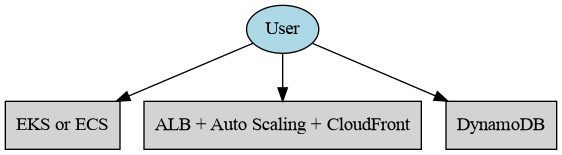

# AWS Architecture Recommendation System



A Flask-based web application that recommends AWS services based on user requirements and generates architecture diagrams.

## Features ✨

- **Smart AWS Service Recommendations**  
  Suggests optimal AWS services based on:
  - Application type (Microservices/Serverless/Monolithic)
  - Expected traffic (Low/Medium/High)
  - Database preference (SQL/NoSQL)
  
- **Dynamic Architecture Diagrams**  
  Automatically generates visual AWS architecture diagrams using Graphviz

- **Download Capabilities**  
  - Download generated diagrams as PNG
  - Save recommendations for future reference

- **History Tracking**  
  Stores previous recommendations in SQLite database

- **REST API Endpoint**  
  JSON API for programmatic access to recommendations

- **Modern UI**  
  Responsive Bootstrap interface with interactive elements

- **Cloud Ready**  
  Dockerized for easy deployment to AWS/Heroku/Render

## Prerequisites 📋

- Python 3.9+
- Graphviz (for diagram generation)
- Docker (optional for containerization)


## File structure 
aws-architecture-recommender/
├── app.py                 # Main application logic
├── requirements.txt       # Dependencies
├── Dockerfile             # Container configuration
├── static/                # Static assets
│   └── aws_architecture.png
├── templates/             # HTML templates
│   ├── index.html
│   ├── result.html
│   └── history.html
└── recommendations.db     # SQLite database

## Installation 🛠️

### 1. Clone Repository
```bash
git clone <repository-name>
cd Cloud-Project

### 2. Install Dependencies

``` pip install -r requirements.txt ```

### 3. Install Graphviz

``` sudo apt-get install graphviz ```


### 4. Initialize Database

```flask --app app.py shell
>>> from app import db
>>> db.create_all()
>>> exit() 
```

### 5. Run the Application

``` flask run --host=0.0.0.0 --port=5000 ```


### 6. Contributing 🤝

    1) Fork the project

    2) Create feature branch (git checkout -b feature/amazing-feature)

    3) Commit changes (git commit -m 'Add amazing feature')

    4) Push to branch (git push origin feature/amazing-feature)

    5) Open Pull Request
